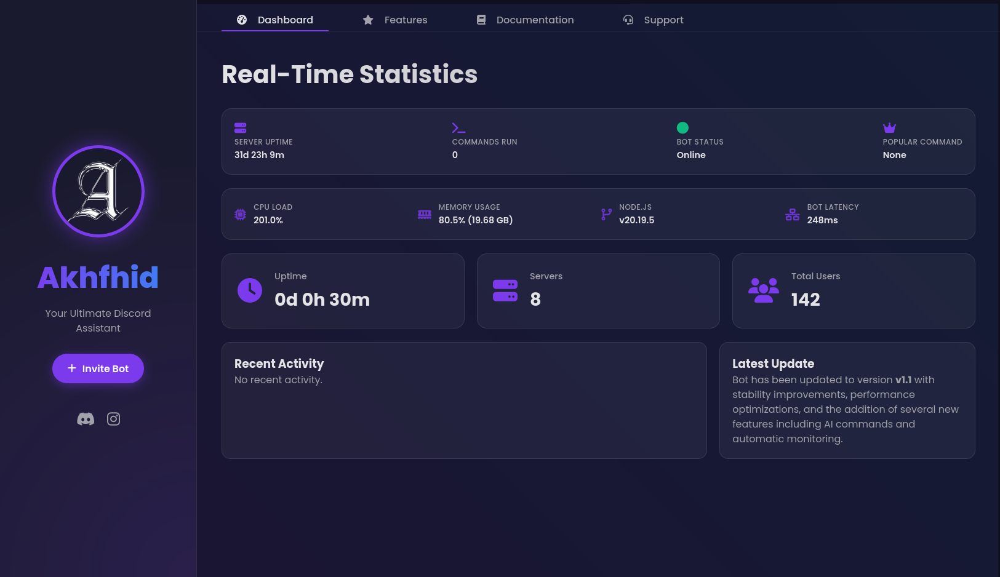

<div align="center">

# Akhfhid-Discord

<a href="https://discord.akhfhid.my.id" target="_blank">
  
</a>

[](https://discord.com/oauth2/authorize?client_id=1439201742599491694&permissions=8&scope=bot%20applications.commands)
[](https://discord.akhfhid.my.id)


A robust, modular, and feature-rich Discord bot built with **Node.js** and **Discord.js v14**. This bot is designed for easy extensibility and comes equipped with essential features for modern Discord servers.

</div>

---

## Features

| Category                   | Feature               | Description                                                                                             |
| :------------------------- | :-------------------- | :------------------------------------------------------------------------------------------------------ |
| **AI Capabilities**        | AI Chat               | Interact with an intelligent AI assistant using `!ai` or `!chat`.                                       |
|                            | Smart Reply           | The bot automatically replies when mentioned, using the conversation context.                           |
|                            | AI Moderation         | Automatically detects and deletes toxic or offensive messages, warning the user.                        |
|                            | AI Summarizer         | Summarize channel activity with `!summary` or `!rangkum`.                                               |
|                            | AI Research           | Conduct deep research on any topic using Perplexity AI integration with `!airesearch` or `!perplexity`. |
|                            | Image Transformation  | Transform images using various AI styles with `!img2img`.                                               |
| **Music System**           | High Quality Playback | Powered by **DisTube** and **ffmpeg** for superior audio quality.                                       |
|                            | Commands              | `!play`, `!queue`, `!skip`, `!stop` to manage music playback.                                           |
|                            | Supported Sources     | Supports YouTube, SoundCloud, Spotify, and more.                                                        |
| **Leveling System**        | XP Tracking           | Users gain XP through chat activity.                                                                    |
|                            | Level Up              | Automatic notifications upon leveling up with custom embeds.                                            |
|                            | Leaderboard           | View the top 10 most active users with `!leaderboard`.                                                  |
|                            | Rank Card             | Check current level and progress with `!level`.                                                         |
| **Utilities & Moderation** | Web Dashboard         | Monitor bot and server statistics via an intuitive web dashboard.                                       |
|                            | User Info             | Retrieve detailed user information with `!userinfo`.                                                    |
|                            | Server Info           | View comprehensive server statistics with `!serverinfo`.                                                |
|                            | Roblox Stalker        | Lookup Roblox user profiles and statistics with `!roblox`.                                              |
|                            | Maintenance Mode      | Announce server maintenance with `!maintenance` and `!maintdone`.                                       |
|                            | Feature Requests      | Users can submit feature requests via `!reqfitur`.                                                      |
| **Automation**             | Scheduled Messages    | Configure daily automated messages (e.g., morning greetings) with `!setschedule`.                       |
|                            | Welcome System        | Customizable welcome messages for new members.                                                          |

## AI Image Transformation (img2img)

The `!img2img` command allows users to transform images into various artistic styles using AI.

**Usage:**

1. Upload an image and add the caption `!img2img`.
2. Or use `!img2img <image_url>`.
3. Select a style from the dropdown menu.

### Available Styles

Below are the available templates and their expected outputs.

#### Default Input Example

*(Placeholder for default input image)*

| Style Template | Description | Output Example |
| :--- | :--- | :--- |
| **Photobox Style** | Modern photobox booth aesthetic with soft lighting and pastel background. | *(Placeholder for Photobox output)* |
| **Photobox Romantic** | Romantic aesthetic with warm nostalgic filter and polaroid frame. | *(Placeholder for Photobox Romantic output)* |
| **Aesthetic Waterfall** | Natural waterfall environment with soft misty water effects. | *(Placeholder for Waterfall output)* |
| **Pixel Art Waterfall** | Pixel art rendition of a natural waterfall scene. | *(Placeholder for Pixel Waterfall output)* |
| **Fantasy Studio Photo** | Dreamy fantasy studio setting with magical glowing lights. | *(Placeholder for Fantasy Studio output)* |
| **Elegant Portrait** | Artistic and clean elegant portrait with smooth shading. | *(Placeholder for Elegant Portrait output)* |
| **Studio Modeling** | Professional fashion model pose with clean monochrome background. | *(Placeholder for Studio Modeling output)* |
| **Gaming Setup** | RGB gaming setup with neon lighting and dual monitors. | *(Placeholder for Gaming Setup output)* |
| **Pixel Art Night Coding** | Pixel art character coding at night with moonlight. | *(Placeholder for Pixel Night Coding output)* |
| **Cozy Reading** | Relaxing scene reading a book in a warm, cozy room. | *(Placeholder for Cozy Reading output)* |
| **Pixel Art** | Retro pixel art style conversion. | *(Placeholder for Pixel Art output)* |
| **Anime Style** | High-quality anime character conversion. | *(Placeholder for Anime output)* |
| **Cyberpunk** | Futuristic cyberpunk aesthetic with neon lights. | *(Placeholder for Cyberpunk output)* |
| **Realistic** | Photorealistic 8k resolution interpretation. | *(Placeholder for Realistic output)* |
| **Watercolor** | Soft watercolor painting style with pastel colors. | *(Placeholder for Watercolor output)* |

## Installation

### Prerequisites

- **Node.js** v16.9.0 or higher
- **FFmpeg** (required for music features)

### Setup

1. **Clone the repository**

  > [!IMPORTANT]
  > **Recommended: Clone the `only-bot` branch**  
  > This branch is the stable, plug-and-play version. It runs immediately and does not require the Web Dashboard files.

  > [!CAUTION]
  > **Avoid the `main` branch unless you are a developer**  
  > The `main` branch includes Web Dashboard code but is missing the `public` and `views` folders (they are not pushed to GitHub).  
  > Cloning `main` without manually restoring these assets will cause runtime errors such as `Failed to lookup view "index"`.

  **Run the following command to clone the stable `only-bot` branch:**

  ```bash
  git clone -b only-bot https://github.com/akhfhid/akhfhid-discord.git
  cd akhfhid-discord
  ```

2. **Install dependencies**

   ```bash
   npm install
   ```

3. **Configure Environment Variables**
   Create a `.env` file in the root directory and add the following configuration:

   ```env
   TOKEN=your_discord_bot_token
   PREFIX=!
   BASE_API=your_api_endpoint
   BASE_URL=your_base_url
   ```

4. **Start the Bot**

   ```bash
   node index.js
   ```

## Discord Bot Creation Guide

If you do not have a Discord bot yet, follow these steps to create one:

1. **Access the Discord Developer Portal**
   Navigate to the [Discord Developer Portal](https://discord.com/developers/applications) and log in with your Discord account.

2. **Create a New Application**

   - Click the **New Application** button in the top right corner.
   - Enter a name for your application (e.g., "MusicBot") and click **Create**.

3. **Configure the Bot**

   - In the left sidebar, click **Bot**.
   - Click **Add Bot** and confirm by selecting **Yes, do it!**.
   - You may customize your bot's icon and username here.

4. **Retrieve the Token**

   - On the Bot page, click the **Reset Token** button to generate your bot token.
   - **IMPORTANT**: Do not share this token. Copy it and paste it into your `.env` file under the `TOKEN` variable.

5. **Enable Privileged Intents**

   - Scroll down to the **Privileged Gateway Intents** section.
   - Enable **Presence Intent**, **Server Members Intent**, and **Message Content Intent**.
   - Click **Save Changes**.

6. **Invite the Bot to Your Server**
   - In the left sidebar, click **OAuth2** then **URL Generator**.
   - Under **Scopes**, check `bot` and `applications.commands`.
   - Under **Bot Permissions**, check `Administrator` (or select specific permissions as needed).
   - Copy the generated URL at the bottom and open it in your browser to invite the bot to your server.

## Project Structure

- `index.js`: Main entry point. Handles bot startup, events, and command loading.
- `handler.js`: Dynamic command and plugin handler.
- `slashHandler.js`: Handles registration and execution of Slash Commands.
- `plugins/`: Contains all text-based commands (prefix commands).
- `slash/`: Contains Slash Command definitions.
- `data/`: Stores JSON data for levels, schedules, etc.
- `utils/`: Utility functions for AI and other helpers.

## Author

**Affan Khulafa Hidayah**

Portfolio: [akhfhid.my.id](https://akhfhid.my.id)

## Contributing

Feel free to fork this repository and submit pull requests. Contributions are welcome.

## License

This project is licensed under the ISC License.
